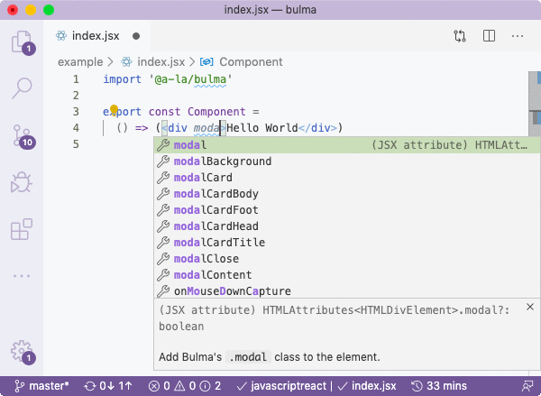

# @a-la/bulma

[](https://www.npmjs.com/package/@a-la/bulma)

`@a-la/bulma` is Bulma Class Properties And Types Definitions For JSX.

```sh
yarn add @a-la/bulma
```



## Table Of Contents

- [Table Of Contents](#table-of-contents)
- [Usage](#usage)
- [Copyright & License](#copyright--license)

<p align="center"><a href="#table-of-contents">
  
</a></p>

## Usage

By installing this package, you will be able to specify classes on tags and components as JSX properties when using [`alamode`](https://github.com/a-la/alamode) transpiler.

To receive access to auto-completions, you'll need to import the `@a-la/bulma` package in your source code:

```jsx
import '@a-la/bulma'

export const Component =
  () => (<div modal>Hello World</div>)
```

The actual import doesn't do anything as the source file is blank. It is needed only for VSCode to pick up distributed typings.

Because of [a bug](https://github.com/microsoft/TypeScript/issues/28905) in VSCode, you won't see properties with hyphens, e.g., `is-loading` and will only see `isLoading`, but you can actually use both. The camel cases are added for discoverability of classes.

<details>
<summary>
Full list of 816 Bulma classes.
<summary>
```
delete
modal-close
is-unselectable
button
file
breadcrumb
pagination-previous
pagination-next
pagination-link
pagination-ellipsis
tabs
select
is-multiple
is-loading
navbar-link
is-arrowless
box
content
notification
progress
table
table-container
title
subtitle
block
highlight
level
list
message
pagination
is-small
is-medium
is-large
loader
control
is-overlay
image
is-square
has-ratio
is-1by1
is-5by4
is-4by3
is-3by2
is-5by3
is-16by9
is-2by1
is-3by1
is-4by5
is-3by4
is-2by3
is-3by5
is-9by16
is-1by2
is-1by3
modal
modal-background
hero-video
input
textarea
file-cta
file-name
is-focused
is-active
is-clearfix
is-pulled-left
is-pulled-right
is-clipped
is-size-1
is-size-2
is-size-3
is-size-4
is-size-5
is-size-6
is-size-7
is-size-1-mobile
is-size-2-mobile
is-size-3-mobile
is-size-4-mobile
is-size-5-mobile
is-size-6-mobile
is-size-7-mobile
is-size-1-tablet
is-size-2-tablet
is-size-3-tablet
is-size-4-tablet
is-size-5-tablet
is-size-6-tablet
is-size-7-tablet
is-size-1-touch
is-size-2-touch
is-size-3-touch
is-size-4-touch
is-size-5-touch
is-size-6-touch
is-size-7-touch
is-size-1-desktop
is-size-2-desktop
is-size-3-desktop
is-size-4-desktop
is-size-5-desktop
is-size-6-desktop
is-size-7-desktop
is-size-1-widescreen
is-size-2-widescreen
is-size-3-widescreen
is-size-4-widescreen
is-size-5-widescreen
is-size-6-widescreen
is-size-7-widescreen
is-size-1-fullhd
is-size-2-fullhd
is-size-3-fullhd
is-size-4-fullhd
is-size-5-fullhd
is-size-6-fullhd
is-size-7-fullhd
has-text-centered
has-text-justified
has-text-left
has-text-right
has-text-centered-mobile
has-text-centered-tablet
has-text-centered-tablet-only
has-text-centered-touch
has-text-centered-desktop
has-text-centered-desktop-only
has-text-centered-widescreen
has-text-centered-widescreen-only
has-text-centered-fullhd
has-text-justified-mobile
has-text-justified-tablet
has-text-justified-tablet-only
has-text-justified-touch
has-text-justified-desktop
has-text-justified-desktop-only
has-text-justified-widescreen
has-text-justified-widescreen-only
has-text-justified-fullhd
has-text-left-mobile
has-text-left-tablet
has-text-left-tablet-only
has-text-left-touch
has-text-left-desktop
has-text-left-desktop-only
has-text-left-widescreen
has-text-left-widescreen-only
has-text-left-fullhd
has-text-right-mobile
has-text-right-tablet
has-text-right-tablet-only
has-text-right-touch
has-text-right-desktop
has-text-right-desktop-only
has-text-right-widescreen
has-text-right-widescreen-only
has-text-right-fullhd
is-capitalized
is-lowercase
is-uppercase
is-italic
has-text-white
has-background-white
has-text-black
has-background-black
has-text-light
has-background-light
has-text-dark
has-background-dark
has-text-primary
has-background-primary
has-text-link
has-background-link
has-text-info
has-background-info
has-text-success
has-background-success
has-text-warning
has-background-warning
has-text-danger
has-background-danger
has-text-black-bis
has-background-black-bis
has-text-black-ter
has-background-black-ter
has-text-grey-darker
has-background-grey-darker
has-text-grey-dark
has-background-grey-dark
has-text-grey
has-background-grey
has-text-grey-light
has-background-grey-light
has-text-grey-lighter
has-background-grey-lighter
has-text-white-ter
has-background-white-ter
has-text-white-bis
has-background-white-bis
has-text-weight-light
has-text-weight-normal
has-text-weight-medium
has-text-weight-semibold
has-text-weight-bold
is-family-primary
is-family-secondary
is-family-sans-serif
is-family-monospace
is-family-code
is-block
is-block-mobile
is-block-tablet
is-block-tablet-only
is-block-touch
is-block-desktop
is-block-desktop-only
is-block-widescreen
is-block-widescreen-only
is-block-fullhd
is-flex
is-flex-mobile
is-flex-tablet
is-flex-tablet-only
is-flex-touch
is-flex-desktop
is-flex-desktop-only
is-flex-widescreen
is-flex-widescreen-only
is-flex-fullhd
is-inline
is-inline-mobile
is-inline-tablet
is-inline-tablet-only
is-inline-touch
is-inline-desktop
is-inline-desktop-only
is-inline-widescreen
is-inline-widescreen-only
is-inline-fullhd
is-inline-block
is-inline-block-mobile
is-inline-block-tablet
is-inline-block-tablet-only
is-inline-block-touch
is-inline-block-desktop
is-inline-block-desktop-only
is-inline-block-widescreen
is-inline-block-widescreen-only
is-inline-block-fullhd
is-inline-flex
is-inline-flex-mobile
is-inline-flex-tablet
is-inline-flex-tablet-only
is-inline-flex-touch
is-inline-flex-desktop
is-inline-flex-desktop-only
is-inline-flex-widescreen
is-inline-flex-widescreen-only
is-inline-flex-fullhd
is-hidden
is-sr-only
is-hidden-mobile
is-hidden-tablet
is-hidden-tablet-only
is-hidden-touch
is-hidden-desktop
is-hidden-desktop-only
is-hidden-widescreen
is-hidden-widescreen-only
is-hidden-fullhd
is-invisible
is-invisible-mobile
is-invisible-tablet
is-invisible-tablet-only
is-invisible-touch
is-invisible-desktop
is-invisible-desktop-only
is-invisible-widescreen
is-invisible-widescreen-only
is-invisible-fullhd
is-marginless
is-paddingless
is-radiusless
is-shadowless
is-relative
icon
is-hovered
is-text
is-white
is-inverted
is-outlined
is-black
is-light
is-dark
is-primary
is-link
is-info
is-success
is-warning
is-danger
is-normal
is-fullwidth
is-static
is-rounded
buttons
are-small
are-medium
are-large
has-addons
is-selected
is-expanded
is-centered
is-right
container
is-fluid
is-widescreen
is-fullhd
is-lower-alpha
is-lower-roman
is-upper-alpha
is-upper-roman
is-16x16
is-24x24
is-32x32
is-48x48
is-64x64
is-96x96
is-128x128
dropdown-item
is-narrow
is-bordered
is-hoverable
is-striped
tags
tag
is-delete
is-spaced
is-1
is-2
is-3
is-4
is-5
is-6
is-7
heading
number
has-fixed-size
checkbox
radio
is-disabled
file-icon
fa
has-name
is-empty
is-boxed
file-label
file-input
label
help
field
has-addons-centered
has-addons-right
has-addons-fullwidth
is-grouped
is-grouped-centered
is-grouped-right
is-grouped-multiline
is-horizontal
field-label
field-body
has-icons-left
has-icons-right
is-left
has-arrow-separator
has-bullet-separator
has-dot-separator
has-succeeds-separator
card
card-header
card-header-title
card-header-icon
card-image
card-content
card-footer
card-footer-item
media
dropdown
dropdown-menu
is-up
dropdown-content
dropdown-divider
is-mobile
level-left
level-right
level-item
is-flexible
list-item
media-left
media-right
media-content
menu
menu-list
menu-label
message-header
message-body
modal-content
modal-card
modal-card-head
modal-card-foot
modal-card-title
modal-card-body
navbar
navbar-brand
navbar-item
navbar-burger
navbar-start
navbar-end
has-dropdown
navbar-dropdown
has-shadow
is-fixed-bottom
is-fixed-top
has-navbar-fixed-top
has-navbar-fixed-bottom
navbar-tabs
navbar-menu
is-tab
navbar-content
navbar-divider
is-fixed-bottom-touch
is-fixed-top-touch
has-navbar-fixed-top-touch
has-navbar-fixed-bottom-touch
is-transparent
has-dropdown-up
is-fixed-bottom-desktop
is-fixed-top-desktop
has-navbar-fixed-top-desktop
has-navbar-fixed-bottom-desktop
has-spaced-navbar-fixed-top
has-spaced-navbar-fixed-bottom
hero
is-fullheight-with-navbar
pagination-list
is-current
panel
panel-heading
panel-tabs
panel-block
panel-icon
panel-list
is-wrapped
is-center
is-toggle
is-toggle-rounded
column
columns
is-full
is-three-quarters
is-two-thirds
is-half
is-one-third
is-one-quarter
is-one-fifth
is-two-fifths
is-three-fifths
is-four-fifths
is-offset-three-quarters
is-offset-two-thirds
is-offset-half
is-offset-one-third
is-offset-one-quarter
is-offset-one-fifth
is-offset-two-fifths
is-offset-three-fifths
is-offset-four-fifths
is-0
is-offset-0
is-offset-1
is-offset-2
is-offset-3
is-offset-4
is-offset-5
is-offset-6
is-offset-7
is-8
is-offset-8
is-9
is-offset-9
is-10
is-offset-10
is-11
is-offset-11
is-12
is-offset-12
is-narrow-mobile
is-full-mobile
is-three-quarters-mobile
is-two-thirds-mobile
is-half-mobile
is-one-third-mobile
is-one-quarter-mobile
is-one-fifth-mobile
is-two-fifths-mobile
is-three-fifths-mobile
is-four-fifths-mobile
is-offset-three-quarters-mobile
is-offset-two-thirds-mobile
is-offset-half-mobile
is-offset-one-third-mobile
is-offset-one-quarter-mobile
is-offset-one-fifth-mobile
is-offset-two-fifths-mobile
is-offset-three-fifths-mobile
is-offset-four-fifths-mobile
is-0-mobile
is-offset-0-mobile
is-1-mobile
is-offset-1-mobile
is-2-mobile
is-offset-2-mobile
is-3-mobile
is-offset-3-mobile
is-4-mobile
is-offset-4-mobile
is-5-mobile
is-offset-5-mobile
is-6-mobile
is-offset-6-mobile
is-7-mobile
is-offset-7-mobile
is-8-mobile
is-offset-8-mobile
is-9-mobile
is-offset-9-mobile
is-10-mobile
is-offset-10-mobile
is-11-mobile
is-offset-11-mobile
is-12-mobile
is-offset-12-mobile
is-narrow-tablet
is-full-tablet
is-three-quarters-tablet
is-two-thirds-tablet
is-half-tablet
is-one-third-tablet
is-one-quarter-tablet
is-one-fifth-tablet
is-two-fifths-tablet
is-three-fifths-tablet
is-four-fifths-tablet
is-offset-three-quarters-tablet
is-offset-two-thirds-tablet
is-offset-half-tablet
is-offset-one-third-tablet
is-offset-one-quarter-tablet
is-offset-one-fifth-tablet
is-offset-two-fifths-tablet
is-offset-three-fifths-tablet
is-offset-four-fifths-tablet
is-0-tablet
is-offset-0-tablet
is-1-tablet
is-offset-1-tablet
is-2-tablet
is-offset-2-tablet
is-3-tablet
is-offset-3-tablet
is-4-tablet
is-offset-4-tablet
is-5-tablet
is-offset-5-tablet
is-6-tablet
is-offset-6-tablet
is-7-tablet
is-offset-7-tablet
is-8-tablet
is-offset-8-tablet
is-9-tablet
is-offset-9-tablet
is-10-tablet
is-offset-10-tablet
is-11-tablet
is-offset-11-tablet
is-12-tablet
is-offset-12-tablet
is-narrow-touch
is-full-touch
is-three-quarters-touch
is-two-thirds-touch
is-half-touch
is-one-third-touch
is-one-quarter-touch
is-one-fifth-touch
is-two-fifths-touch
is-three-fifths-touch
is-four-fifths-touch
is-offset-three-quarters-touch
is-offset-two-thirds-touch
is-offset-half-touch
is-offset-one-third-touch
is-offset-one-quarter-touch
is-offset-one-fifth-touch
is-offset-two-fifths-touch
is-offset-three-fifths-touch
is-offset-four-fifths-touch
is-0-touch
is-offset-0-touch
is-1-touch
is-offset-1-touch
is-2-touch
is-offset-2-touch
is-3-touch
is-offset-3-touch
is-4-touch
is-offset-4-touch
is-5-touch
is-offset-5-touch
is-6-touch
is-offset-6-touch
is-7-touch
is-offset-7-touch
is-8-touch
is-offset-8-touch
is-9-touch
is-offset-9-touch
is-10-touch
is-offset-10-touch
is-11-touch
is-offset-11-touch
is-12-touch
is-offset-12-touch
is-narrow-desktop
is-full-desktop
is-three-quarters-desktop
is-two-thirds-desktop
is-half-desktop
is-one-third-desktop
is-one-quarter-desktop
is-one-fifth-desktop
is-two-fifths-desktop
is-three-fifths-desktop
is-four-fifths-desktop
is-offset-three-quarters-desktop
is-offset-two-thirds-desktop
is-offset-half-desktop
is-offset-one-third-desktop
is-offset-one-quarter-desktop
is-offset-one-fifth-desktop
is-offset-two-fifths-desktop
is-offset-three-fifths-desktop
is-offset-four-fifths-desktop
is-0-desktop
is-offset-0-desktop
is-1-desktop
is-offset-1-desktop
is-2-desktop
is-offset-2-desktop
is-3-desktop
is-offset-3-desktop
is-4-desktop
is-offset-4-desktop
is-5-desktop
is-offset-5-desktop
is-6-desktop
is-offset-6-desktop
is-7-desktop
is-offset-7-desktop
is-8-desktop
is-offset-8-desktop
is-9-desktop
is-offset-9-desktop
is-10-desktop
is-offset-10-desktop
is-11-desktop
is-offset-11-desktop
is-12-desktop
is-offset-12-desktop
is-narrow-widescreen
is-full-widescreen
is-three-quarters-widescreen
is-two-thirds-widescreen
is-half-widescreen
is-one-third-widescreen
is-one-quarter-widescreen
is-one-fifth-widescreen
is-two-fifths-widescreen
is-three-fifths-widescreen
is-four-fifths-widescreen
is-offset-three-quarters-widescreen
is-offset-two-thirds-widescreen
is-offset-half-widescreen
is-offset-one-third-widescreen
is-offset-one-quarter-widescreen
is-offset-one-fifth-widescreen
is-offset-two-fifths-widescreen
is-offset-three-fifths-widescreen
is-offset-four-fifths-widescreen
is-0-widescreen
is-offset-0-widescreen
is-1-widescreen
is-offset-1-widescreen
is-2-widescreen
is-offset-2-widescreen
is-3-widescreen
is-offset-3-widescreen
is-4-widescreen
is-offset-4-widescreen
is-5-widescreen
is-offset-5-widescreen
is-6-widescreen
is-offset-6-widescreen
is-7-widescreen
is-offset-7-widescreen
is-8-widescreen
is-offset-8-widescreen
is-9-widescreen
is-offset-9-widescreen
is-10-widescreen
is-offset-10-widescreen
is-11-widescreen
is-offset-11-widescreen
is-12-widescreen
is-offset-12-widescreen
is-narrow-fullhd
is-full-fullhd
is-three-quarters-fullhd
is-two-thirds-fullhd
is-half-fullhd
is-one-third-fullhd
is-one-quarter-fullhd
is-one-fifth-fullhd
is-two-fifths-fullhd
is-three-fifths-fullhd
is-four-fifths-fullhd
is-offset-three-quarters-fullhd
is-offset-two-thirds-fullhd
is-offset-half-fullhd
is-offset-one-third-fullhd
is-offset-one-quarter-fullhd
is-offset-one-fifth-fullhd
is-offset-two-fifths-fullhd
is-offset-three-fifths-fullhd
is-offset-four-fifths-fullhd
is-0-fullhd
is-offset-0-fullhd
is-1-fullhd
is-offset-1-fullhd
is-2-fullhd
is-offset-2-fullhd
is-3-fullhd
is-offset-3-fullhd
is-4-fullhd
is-offset-4-fullhd
is-5-fullhd
is-offset-5-fullhd
is-6-fullhd
is-offset-6-fullhd
is-7-fullhd
is-offset-7-fullhd
is-8-fullhd
is-offset-8-fullhd
is-9-fullhd
is-offset-9-fullhd
is-10-fullhd
is-offset-10-fullhd
is-11-fullhd
is-offset-11-fullhd
is-12-fullhd
is-offset-12-fullhd
is-gapless
is-multiline
is-vcentered
is-desktop
is-variable
is-0-tablet-only
is-0-desktop-only
is-0-widescreen-only
is-1-tablet-only
is-1-desktop-only
is-1-widescreen-only
is-2-tablet-only
is-2-desktop-only
is-2-widescreen-only
is-3-tablet-only
is-3-desktop-only
is-3-widescreen-only
is-4-tablet-only
is-4-desktop-only
is-4-widescreen-only
is-5-tablet-only
is-5-desktop-only
is-5-widescreen-only
is-6-tablet-only
is-6-desktop-only
is-6-widescreen-only
is-7-tablet-only
is-7-desktop-only
is-7-widescreen-only
is-8-tablet-only
is-8-desktop-only
is-8-widescreen-only
tile
is-ancestor
is-child
is-parent
is-vertical
is-bold
hero-body
is-halfheight
is-fullheight
hero-buttons
hero-head
hero-foot
section
footer
```
</details>

<p align="center"><a href="#table-of-contents">
  
</a></p>


## Copyright & License

GNU Affero General Public License v3.0

<table>
  <tr><td></td><td>© <a href="https://alamode.cc">À La Mode</a> 2020</td></tr>
</table>

<p align="center"><a href="#table-of-contents">
  
</a></p>